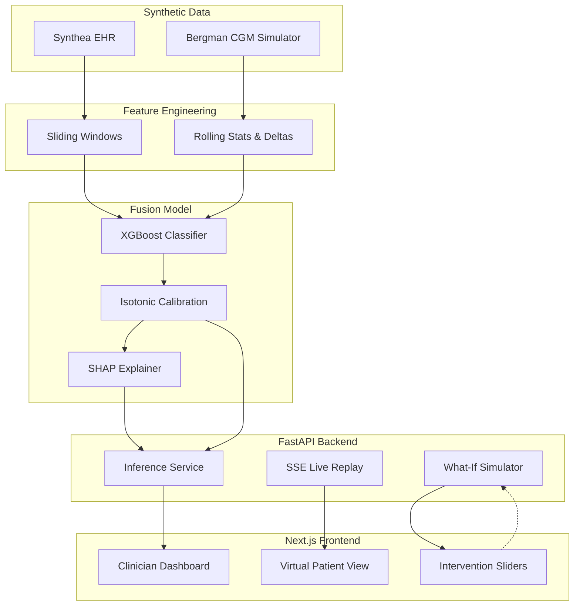

```mermaid
graph TD
    subgraph Data Sources [Synthetic Data]
        EHR[Synthea EHR]
        CGM[Bergman CGM Simulator]
    end
    
    subgraph Feature Store [Feature Engineering]
        SW[Sliding Windows]
        Stats[Rolling Stats & Deltas]
    end
    
    subgraph ML Pipeline [Fusion Model]
        XGB[XGBoost Classifier]
        Cal[Isotonic Calibration]
        SHAP[SHAP Explainer]
    end
    
    subgraph API [FastAPI Backend]
        Inf[Inference Service]
        Sim[What-If Simulator]
        SSE[SSE Live Replay]
    end
    
    subgraph UI [Next.js Frontend]
        CD[Clinician Dashboard]
        VP[Virtual Patient View]
        WI[Intervention Sliders]
    end
    
    EHR --> SW
    CGM --> Stats
    SW --> XGB
    Stats --> XGB
    XGB --> Cal
    Cal --> SHAP
    SHAP --> Inf
    Cal --> Inf
    
    Inf --> CD
    SSE --> VP
    Sim --> WI
    WI -.-> Sim
```
